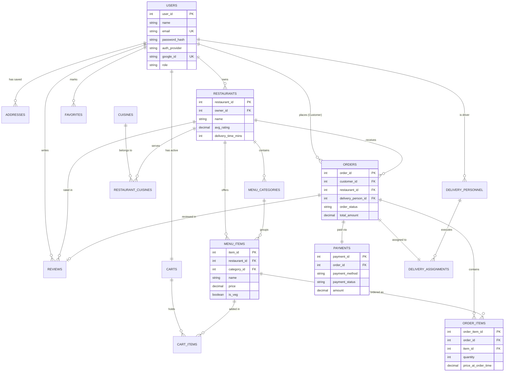

# Entity-Relationship (ER) Diagram Specification

## 1. Overview
The database models an online food ordering and delivery ecosystem with 16 entities supporting customers, restaurant owners, delivery personnel, menu management, order workflows, mock payments, ratings/reviews, and customer favorites.

---

## 2. Mermaid ER Diagram

---

## 3. Entity Descriptions & Cardinalities

1. **USERS**: Represents system actors (`customer`, `restaurant_admin`, `delivery`, `admin`).
   - `1 : N` with `ADDRESSES` (A customer can save multiple delivery addresses).
   - `1 : N` with `ORDERS` (A customer can place multiple orders).
   - `1 : 1` with `CARTS` (A customer has exactly one active cart).
2. **RESTAURANTS**: Represents food establishments managed by restaurant admins.
   - `1 : N` with `MENU_CATEGORIES` and `MENU_ITEMS`.
   - `M : N` with `CUISINES` via `RESTAURANT_CUISINES`.
3. **ORDERS & ORDER_ITEMS**: Tracks food orders.
   - `ORDER_ITEMS` is a junction table capturing `quantity` and freezing `price_at_order_time` to ensure historic accuracy when menu prices change.
4. **PAYMENTS**: Mock payment records linked 1-to-1 with orders.
5. **DELIVERY_ASSIGNMENTS**: Assigns orders to delivery drivers and logs timestamps (`assigned_at`, `picked_up_at`, `delivered_at`).
